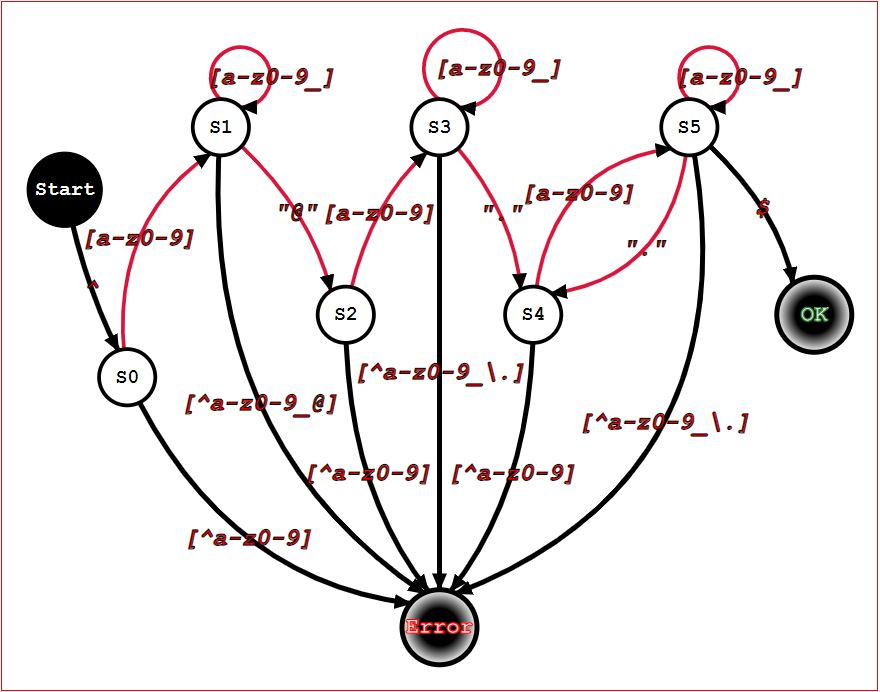
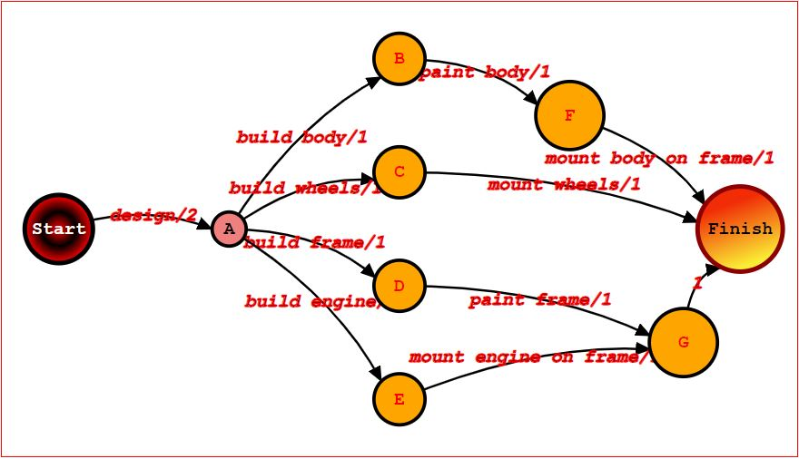
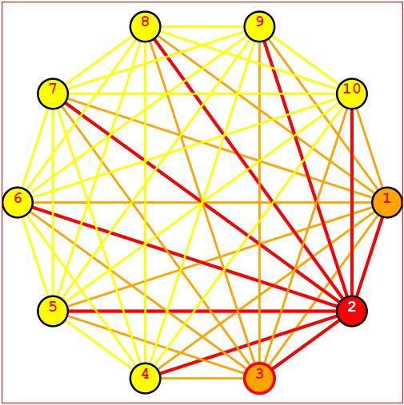
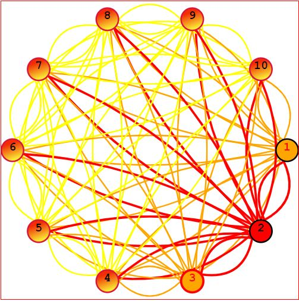
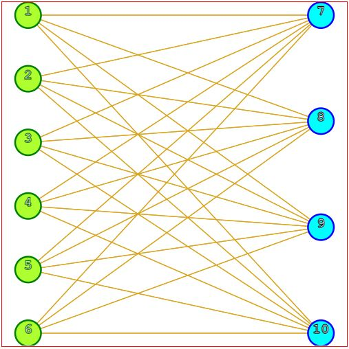

# **JsGraphs**

[](https://lgtm.com/projects/g/mlarocca/jsgraphs/context:javascript)
[](https://lgtm.com/projects/g/mlarocca/jsgraphs/alerts/)

A lightweight library to model graphs, run graphs algorithms, and display them on screen.

You can use this library to create arbitrarily complex graphs and run [**algorithms**](./readme/tutorial.md#graph-algorithms) and transformations on them, or just use it for [**visualization**](./readme/tutorial.md#embedding), importing graphs or even embeddings created in other languages/platforms and serialized using _JSON_.

Graphs can be embedded in the plane, vertices can be positioned arbitrarily, and both vertices and edges can be styled individually.

# **Getting Started**

## **Installation**

From the base folder:

```bash
nvm install stable

npm install
```

## **Run tests**

From the base folder:

```bash
npm t test/$FOLDER/$TEST
```

For instance

```bash
npm t test/geometric/test_point.js
```

## **Bundle**

To bundle the library, I used [Webpack](https://webpack.js.org) - but you can use whatever you like.

```bash
npm run bundle
```

A word of caution, though: the combination of ECMAScript modules and advanced features (ES2019) makes configuration non-trivial.

Check out how to configure babel plugins in [webpack.config.js](./webpack.config.js).

# [**Graph Theory**](https://www.manning.com/books/algorithms-and-data-structures-in-action#toc)

For an introduction to Graph, feel free to take a look at ["Algorithms and Data Structures in Action](https://www.manning.com/books/algorithms-and-data-structures-in-action#toc)
In particular you can check out online, on Manning's livebook site:

- [Chapter 14](https://livebook.manning.com/book/algorithms-and-data-structures-in-action/chapter-14) for an intro to graph data structure.
- [Appendix B](https://livebook.manning.com/book/algorithms-and-data-structures-in-action/appendix-b) for an intro to Big-O notation.
- [Appendix C](https://livebook.manning.com/book/algorithms-and-data-structures-in-action/appendix-c) for a summary of core data structures like trees or linked lists.

# [**Tutorial**](./readme/tutorial.md)

[](./readme/tutorial.md)

To learn by example what you can do with _JsGraphs_ and how to do it, check out this [**tutorial**](./readme/tutorial.md).

# [**Examples**](./readme/examples.md)

**(click on the images to browse to the example)**

[](readme/examples.md#regex-finite-state-automaton)
[](readme/examples.md#dag)
[](readme/examples.md#complete-graphs)
[](readme/examples.md#complete-bipartite-graphs)

# **RoadMap**

Here we keep a list of the roadmap for the development of this library. If you have ideas or suggestions, feel free to open an issue (to suggest a feature or report a problem) or a Pull Request, to contribute to the development.

## **Algorithms**

- [x] BFS
- [X] DFS
- [X] Graph transpose
- [X] Symmetric closure
- [X] Connected Components
- [X] Strongly Connected Components
- [X] Topological Sorting
- [ ] Biconnected Components
- [ ] [Dijkstra's](https://github.com/mlarocca/jsgraphs/issues/16)
- [ ] [Bellman-Ford's](https://github.com/mlarocca/jsgraphs/issues/17)
- [ ] [A*](https://github.com/mlarocca/jsgraphs/issues/18)
- [ ] Kruskal's
- [ ] Prim's
- [ ] Floyd-Warshall's
- [ ] Transitive Closure
- [ ] Edmonds-Karp's
- [ ] Relabel to Front
- [X] Planarity Testing (naive)
- [ ] Planarity Testing (linear-time)

## **Features**

- [ ] Custom label/weights separator
- [ ] [Edge.setLabel](https://github.com/mlarocca/jsgraphs/issues/23)
- [ ] [removeVertex()](https://github.com/mlarocca/jsgraphs/issues/20)
- [ ] [removeEdge()](https://github.com/mlarocca/jsgraphs/issues/21)
- [X] Add label and data fields for vertices
- [ ] Add options to display/hide vertex name/label
- [ ] Union of 2 disjoint graphs
- [ ] DFS returns all cycles found

### **Generators**

- [x] Complete Graphs
- [x] Bipartite Complete Graphs
- [ ] Square Mesh
- [ ] Triangular Mesh
- [ ] Random Graph

# **License**

This library ships under [GNU Affero General Public License](./LICENSE)