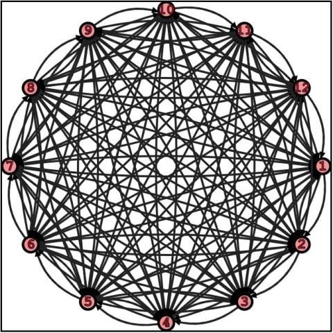

# **JsGraphs**
A lightweight library to model graphs, run graphs' algorithms, and display them on screen.

# **Getting Started**

## **Installation**

From the base folder:

```bash
nvm install stable

npm install
```

## **Run tests**

From the base folder:

```bash
npm t test/$FOLDER/$TEST
```

For instance

```bash
npm t test/geometric/test_point.js
```

## **Bundle**

To bundle the library, I used [Webpack](https://webpack.js.org) - but you can use whatever you like.

A word of caution, though: the combination of ECMAScript modules and advanced features (ES2019) makes configuration non-trivial.

Check out how to configure babel plugins in [webpack.config.js](./webpack.config.js).

# [**Tutorial**](./readme/tutorial.md)



To learn by example what you can do with _JsGraphs_ and how to do it, check out this [tutorial](./readme/tutorial.md)

# **Examples**

The library allows to create arbitrary graphs, but also
Graphs can be embedded in the plane, vertices can be positioned arbitrarily, and both vertices and edges can be styled individually.

(click on the images to browse to the example)
[](readme/examples.md#regex-finite-state-automaton)
[](readme/examples.md#dag)
[](readme/examples.md#complete-graphs)
[](readme/examples.md#complete-bipartite-graphs)