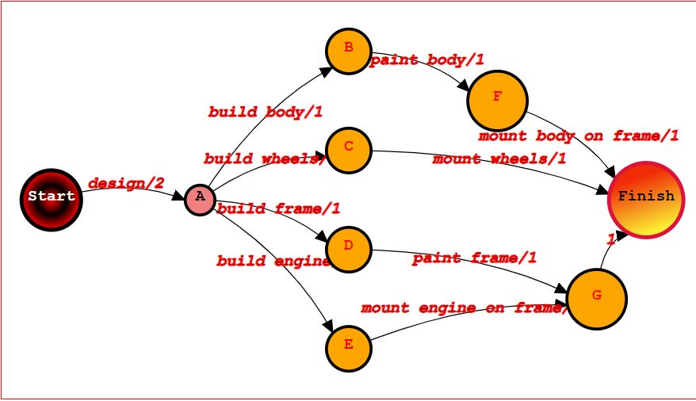
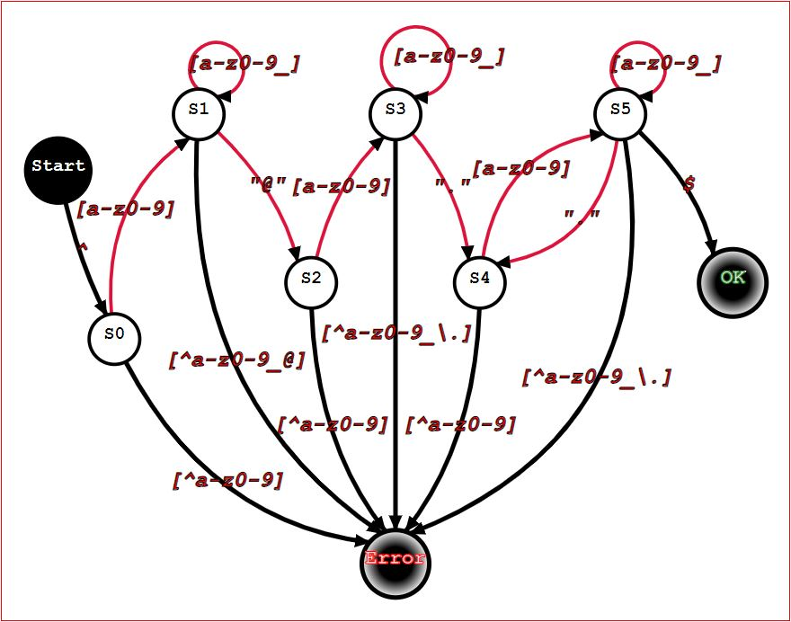

# jsgraphs
A lightweight library to model graphs, run graphs' algorithms, and display them on screen.

# Installation

From the base folder:

```bash
nvm install stable

npm install
```


# Run tests

From the base folder:

```bash
npm t test/$FOLDER/$TEST
```

For instance

```bash
npm t test/geometric/test_point.js
```

# Examples

The library allows to create arbitrary graphs, but also
Graphs can be embedded in the plane, vertices can be positioned arbitrarily, and both vertices and edges can be styled individually.

## Complete Graphs
In complete graphs, every vertex is connected to every other vertex by an edge.

```javascript
import Embedding from '/src/graph/embedding/embedding.js';

Embedding.completeGraph(10, 400)
  .toSvg(400, 400, {
    graphCss: ['complete'],
    verticesCss: { '1': ['warning'], '2': ['error'], '3': ['warning', 'source'] },
    displayEdgesWeight: false,
    displayEdgesLabel: false
    /*drawEdgesAsArcs: true // optionally*/
  }));
```


## Complete Bipartite Graphs

In bipartite-complete graphs, there are two sets of vertices, set A and set B, and every vertex in A is connected to every in B by an edge.

```javascript
import Embedding from '/src/graph/embedding/embedding.js';
import { range } from '/src/common/numbers.js';

let vClasses = {};
range(1, 7).forEach(i => vClasses[`${i}`] = ['left']);
range(7, 11).forEach(i => vClasses[`${i}`] = ['right']);

Embedding.completeBipartiteGraph(6, 4, 400)
  .toSvg(400, 400, {
    graphCss: ['complete bipartite'],
    verticesCss: vClasses,
    displayEdgesWeight: false,
    displayEdgesLabel: false
  }));
```


## DAG

A DAG (Directed Acyclic Graph) is a kind of graph often used to model structured information, for instance for compilers, spreadsheets and electronic circuits design,  or inter-dependent events, like in Bayesian newtworks.

```javascript
import Embedding from '/src/graph/embedding/embedding.js';
import Graph from '/src/graph/graph.js';

let graph = new Graph();
graph.createVertex('Start', { weight: 2 });
graph.createVertex('A');
graph.createVertex('B', { weight: 1.5 });
graph.createVertex('C', { weight: 1.5 });
graph.createVertex('D', { weight: 1.5 });
graph.createVertex('E', { weight: 1.5 });
graph.createVertex('F', { weight: 2 });
graph.createVertex('G', { weight: 2 });
graph.createVertex('Finish', { weight: 2.5 });
graph.createEdge('Start', 'A', { label: 'design', weight: 2 });
graph.createEdge('A', 'B', { label: 'build body' });
graph.createEdge('A', 'C', { label: 'build wheels' });
graph.createEdge('A', 'D', { label: 'build frame' });
graph.createEdge('A', 'E', { label: 'build engine' });
graph.createEdge('B', 'F', { label: 'paint body' });
graph.createEdge('D', 'G', { label: 'paint frame' });
graph.createEdge('C', 'Finish', { label: 'mount wheels' });
graph.createEdge('E', 'G', { label: 'mount engine on frame' });
graph.createEdge('F', 'Finish', { label: 'mount body on frame' });
graph.createEdge('G', 'Finish');

let emb = Embedding.forGraph(graph);

emb.setVertexPosition(Vertex.serializeLabel('Start'), new Point2D(50, 200));
emb.setVertexPosition(Vertex.serializeLabel('A'), new Point2D(200, 200));
emb.setVertexPosition(Vertex.serializeLabel('B'), new Point2D(350, 50));
emb.setVertexPosition(Vertex.serializeLabel('C'), new Point2D(350, 150));
emb.setVertexPosition(Vertex.serializeLabel('D'), new Point2D(350, 250));
emb.setVertexPosition(Vertex.serializeLabel('E'), new Point2D(350, 350));
emb.setVertexPosition(Vertex.serializeLabel('F'), new Point2D(500, 100));
emb.setVertexPosition(Vertex.serializeLabel('G'), new Point2D(600, 300));
emb.setVertexPosition(Vertex.serializeLabel('Finish'), new Point2D(650, 200));

let vClasses = {
  '"Start"': ['start'],
  '"Finish"': ['finish', 'body', 'wheels', 'frame', 'engine'],
  '"A"': ['init'],
  '"B"': ['build', 'body'],
  '"C"': ['build', 'wheels'],
  '"D"': ['build', 'frame'],
  '"E"': ['build', 'engine'],
  '"F"': ['paint', 'body'],
  '"F"': ['paint', 'frame'],
  '"G"': ['mount', 'body', 'frame', 'engine']
};

emb.toSvg(700, 400, { verticesCss: vClasses, drawEdgesAsArcs: true });
```



## RegEx Finite State Automaton

Every **reg**ular **ex**pression can be translated to an _FSA_ (**F**inite **S**tate **A**utomaton), which in turn can be represented using a directed graph.

This example shows a regular expression for email validation: note that it intentionally uses a simpler regex than the most generic one, accepting only  a subset of all valid emails.

```javascript
import Embedding from '/src/graph/embedding/embedding.js';
import Graph from '/src/graph/graph.js';

let graph = new Graph();
const start = graph.createVertex('Start', { weight: 2 });
const endValidated = graph.createVertex('OK', { weight: 2 });
const endError = graph.createVertex('Error', { weight: 2 });
const s0 = graph.createVertex('S0', { weight: 1.5 });
const s1 = graph.createVertex('S1', { weight: 1.5 });
const s2 = graph.createVertex('S2', { weight: 1.5 });
const s3 = graph.createVertex('S3', { weight: 1.5 });
const s4 = graph.createVertex('S4', { weight: 1.5 });
const s5 = graph.createVertex('S5', { weight: 1.5 });

let edgeStart = graph.createEdge(start, s0, { weight: 3, label: '^' });
let edgeS0S1 = graph.createEdge(s0, s1, { label: "[a-z0-9]" });
let edgeS1Loop = graph.createEdge(s1, s1, { label: "[a-z0-9_]" });
graph.createEdge(s1, s2, { label: '"@"' });
graph.createEdge(s2, s3, { label: "[a-z0-9]" });
graph.createEdge(s3, s3, { label: "[a-z0-9_]" });
graph.createEdge(s3, s4, { label: '"."' });
let edgeS4S5 = graph.createEdge(s4, s5, { label: "[a-z0-9]" });
let edgeS5Loop = graph.createEdge(s5, s5, { label: "[a-z0-9_]" });
let edgeS5S4 = graph.createEdge(s5, s4, { label: '"."' });
let edgeEnd = graph.createEdge(s5, endValidated, { label: '$' });

let edgeS0Error = graph.createEdge(s0, endError, { label: '[^a-z0-9]' });
let edgeS1Error = graph.createEdge(s1, endError, { label: '[^a-z0-9_@]' });
let edgeS2Error = graph.createEdge(s2, endError, { label: "[^a-z0-9]" });
let edgeS3Error = graph.createEdge(s3, endError, { label: "[^a-z0-9_\\.]" });
let edgeS4Error = graph.createEdge(s4, endError, { label: '[^a-z0-9]' });
let edgeS5Error = graph.createEdge(s5, endError, { label: '[^a-z0-9_\\.]' });

let emb = Embedding.forGraph(graph, { width: 700, height: 400 });

// Set the position of each vertex
emb.setVertexPosition(start, new Point2D(50, 150));
emb.setVertexPosition(s0, new Point2D(100, 300));
emb.setVertexPosition(s1, new Point2D(175, 100));
emb.setVertexPosition(s2, new Point2D(275, 250));
emb.setVertexPosition(s3, new Point2D(350, 100));
emb.setVertexPosition(s4, new Point2D(425, 250));
emb.setVertexPosition(s5, new Point2D(550, 100));
emb.setVertexPosition(endValidated, new Point2D(650, 250));
emb.setVertexPosition(endError, new Point2D(350, 500));

// Adjust the curvature of some edges
emb.setEdgeControlPoint(edgeStart, -10);
emb.setEdgeControlPoint(edgeS0S1, 60);
emb.setEdgeControlPoint(edgeS4S5, 70);
emb.setEdgeControlPoint(edgeS5S4, 70);
emb.setEdgeControlPoint(edgeS1Loop, 20);
emb.setEdgeControlPoint(edgeS5Loop, 20);

emb.setEdgeControlPoint(edgeS0Error, -80);
emb.setEdgeControlPoint(edgeS1Error, -120);
emb.setEdgeControlPoint(edgeS2Error, -40);
emb.setEdgeControlPoint(edgeS3Error, 0);
emb.setEdgeControlPoint(edgeS4Error, 40);
emb.setEdgeControlPoint(edgeS5Error, 175);

// Vertices/edges can be styled individually by applying them css classes
let vCss = {
  [start.id]: ['start'],
  [endValidated.id]: ['end'],
  [endError.id]: ['end', 'error']
};
let eCss = {
  [edgeStart.id]: ['start'],
  [edgeEnd.id]: ['end'],
  [edgeS0Error.id]: ['end', 'error'],
  [edgeS1Error.id]: ['end', 'error'],
  [edgeS2Error.id]: ['end', 'error'],
  [edgeS3Error.id]: ['end', 'error'],
  [edgeS4Error.id]: ['end', 'error'],
  [edgeS5Error.id]: ['end', 'error']
};

emb.toSvg(700, 550, {
  graphCss: ['FSA'],
  verticesCss: vCss,
  edgesCss: eCss,
  drawEdgesAsArcs: true,
  displayEdgesWeight: false
});
```

