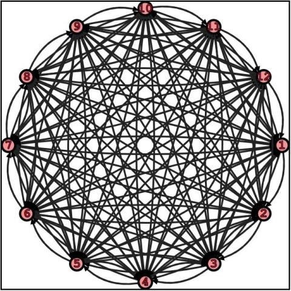

# JSGraphs Tutorial

There are two main entities that can be created in this library: graphs (class [_Graph_](../src/graph/graph.js)) and embeddings ([_Embedding_](../src/graph/embedding/embedding.js)).

The former focuses on modeling data and transforming it through algorithms, the latter is used to represent graphs on display (or paper!).

# Graph

A graph is a data structure that allow modeling interconnected data, where heterogeneous entities (the graph's vertices) can be in relation among them; these relations are modeled by graph's edges.

In _JsGraphs_, creating a graph is quite simple:

```javascript
import Graph from '/src/graph/graph.mjs';

let graph = new Graph();
```

The instance variable graph now has been created, without any vertex or edge. Of course, these entities are also modeled in the library:

## Vertices

Class [`Vertex`](../src/graph/vertex.js) implement the first basic component of any graph, in turn modeling the entities (data) part of a graph.

```javascript
import Vertex from '/src/graph/vertex.mjs';

const v = new Vertex('vertex label', {weight: 3});
const u = new Vertex('u');
```

Vertices in _JsGraphs_ are immutable, hence `u` and `v` above are real consts. On creation, you must add a label for the vertex, and optionally a weight: the default weight for a vertex is 1, and generally you don't have to worry about this weight, but some graph applications can use it.

A vertex's label doesn't have to be a string, it can be any object that can be serialized to the `JSON` format: strings, numbers, arrays, plain JS objects, or custom objects that have a `toJson` method.

It is possible to use the `static` method `Vertex.isSerializable` to check if a value is a valid label:

```javascript
Vertex.isSerializable(1);   // true
Vertex.isSerializable('abc');   // true
Vertex.isSerializable([1, 2, true, 'a']);   // true
Vertex.isSerializable({a: [1, 2, 3], b: {x: -1, y: 0.5}});   // true
Vertex.isSerializable(new Vertex('test'));   // true, Vertex has a toJson() method
Vertex.isSerializable(new Graph());   // true!! Graph has a toJson() method

Vertex.isSerializable(new Map());   // false
Vertex.isSerializable(new Set());   // false
Vertex.isSerializable(() => true));   // false, functions can't be serialized to JSON
```

Existing vertices can be added to graphs: notice that it's NOT possible to add two vertices with the same label to the same graph.

```javascript
let graph = new Graph();
const v = new Vertex('v', {weight: 3});
const u = new Vertex('u');

graph.addVertex(v);
graph.addVertex(u);
// graph.addVertex(new Vertex('u)) // ERROR, duplicated vertex 'u'
```


There is also a shortcut to create those vertices directly on the graph, without first creating them as a separate variable; besides being shorter, this way is also more efficient, because vertices (and edges) _added_ to a graph are actually cloned beforehand (meaning that, in the example above, a clone of `v` and `u` is actually added to `graph`).

```javascript
let graph = new Graph();

const vId = graph.createVertex(['I', 'am', 'a', 'valid', 'label'], {weight: 3});
const uId = graph.createVertex('u');
// graph.createVertex('u) // ERROR, duplicated vertex 'u'
```

As you can see in the snippet above, `createVertex` (as well as `addVertex`) returns the ID of the vertex created (NOT a reference to the actual instance held by the graph).

Each vertex, in fact, has an `id` property that uniquely identifies it in a graph: as mentioned, there can't be two vertices with the same label, so there is a 1:1 correspondence between labels and IDs. This means that the IDs of two instances of `Vertex` can clash even if they are different objects, or if they have different properties.

```javascript
const u1 = new Vertex('u', {weight: 3});
const u2 = new Vertex('u');

console.log(u1.equals(u2));     // false
console.log(u1.id === u2.id);   // true
```

You might want to hold to the id of a vertex, because you will need it to retrieve a reference to the actual vertex from the graph, and even to create a new edge (as we'll see in the next section).

```javascript
const u = graph.getVertex(uId);
const v = graph.getVertex(vId);
```

Most of the methods on graphs can take either an id, or a copy of the object to retrieve (namely a vertex or an edge).
For instance:

```javascript
graph.getVertex(uId);
graph.getVertex(graph.getVertex(uId));
```

both work and return a reference to vertex `u` (although the latter does that very inefficiently!).

Once you get ahold of a reference to a graph's vertex, you can read all its fields, but you can only update its weight.


>  Although having vertices as perfectly immutable entities would have been desirable, this would have had repercussions on the performance of the graph, because updating a vertex `v`'s weight would have meant replacing `v` in the graph with a new instance of `Vertex`, and also updating all the references to `v` in (potentially, up to ) all the edges in the graph.
As a compromise, a vertex' label and id are kept immutable and impossible to change, while weight is mutable. Similar compromises will be made for embedded vertices and edges.
Switching to `TypeScript`, or whenever a future `EcmaScript` specification will include protected fields, would allow for more flexibility and possibly this aspect will be reviewed. For now, changing the mutable attributes of a graph's vertices and edges directly is **discouraged**: the **forward-compatible** way is going to be changing them through the `Graph` and `Embedding`'s methods.


## Edges

The other fundamental entity on which graphs are based are _edges_, implemented in class [`Edge`](../src/graph/edge.js).

Creating a new edge is as simple as creating a new vertex, except that we need to pass two instances of `Vertex` to the edge's constructor, for its source and destination:

```javascript
import Vertex from '/src/graph/vertex.mjs';
import Edge from '/src/graph/edge.mjs';

const v = new Vertex('vertex label', {weight: 3});
const u = new Vertex('u');

const e = new Edge(u, v, {weight: 0.4, label: "I'm an edge!"});
```

Like vertices, Edges are only mutable for what concers their weight: it's the only field of an edge that can be changed after it's created.

And likewise, edges also have an `id` field, that uniquely identify them in a graph: in simple graphs (like the ones implemented in classes `Graph` and `UndirectedGraph`), there can be at most a single edge between two vertices, so an edge's ID is based on the IDs of its source and destination, and can uniquely identify an edge _within a graph_.

Note that two edges detached from any graph, or belonging to two different graphs, could be different while having the same ID (because, for instance, they have a different label or weight), but this is not possible within any individual graph.

### Creating Edges

You can add an existing edge to a graph with method `addEdge`, or equivalently (and perhaps more easily), you can create the new edge directly through an instance of `graph`:

```javascript
import Vertex from '/src/graph/vertex.mjs';
import Edge from '/src/graph/edge.mjs';
import Graph from '/src/graph/graph.mjs';

let g = new Graph();
const v = g.createVertex('v', {weight: 1.5});
const u = g.createVertex('u', {weight: 1.5});

const e = g.createEdge(u, v, {weight: 0.4, label: "I'm an edge!"});
```


### Directed vs Undirected

While the vertices at the two ends of an edge uniquely determine the edge's ID, it has to be clear that their order matters, at least in directed graphs.

In directed graphs, in fact, each edge has a direction associated, from its source to its destination, and so an edge from vertex `'u'` to vertex `'v'` is different than one from `'v'` to `'u'`.

```javascript
let g = new Graph();
const v = g.createVertex('v', {weight: 1.5});
const u = g.createVertex('u', {weight: 1.5});

const e1 = g.createEdge(u, v, {weight: 0.4, label: "back"});
const e2 = g.createEdge(v, u, {weight: 1.4, label: "and forth"});
```


### Weight Matter

While for vertices we saw that weight is something useful in niche situations, it's much more common to set a weight for edges: many graph's algorithms like _Dijkstra's_ or _A*_ make sense only on weighted graphs (while for unweighted graphs, i.e. graphs whose edges have no weights associated, we can likely make do with _BFS_).

In many applications we'll need to update the weight of graph edges after its creation: like for vertices, it is possible to retrieve an edge and update its weight, but the safest way to do so is by using the `setEdgeWeight` method on an instance of `Graph`.

```javascript
let g = new Graph();
const v = g.createVertex('v', {weight: 1.5});
const u = g.createVertex('u', {weight: 1.5});

const e = g.createEdge(u, v, {weight: 0.4, label: "back"});
g.setEdgeWeight(e, 1.5);
g.setEdgeWeight(e.id, -3.1);
```

### Retrieving an Edge

The easiest way to get ahold of a reference to a graph's edge is through its ID:

```javascript
let e = g.getEdge(e.id);
e = g.getEdge(edgeID);  // Assuming you have the ID stored in this variable
```

If you don't have the edge's ID at hand, though, do not despair! You can also retrieve an edge by passing its source and destination to method `getEdgeBetween` (since, as mentioned, there can only be one vertex in a simple graph from a source to a destination).

```javascript
let e = g.getEdgeBetween(u, v);
// You can also pass vertices' IDs
e = g.getEdgeBetween(u.id, v.id);
// ... and even mix them
e = g.getEdgeBetween(u, v.id);
e = g.getEdgeBetween(u.id, v);
```

### Loops

Last but not least, so far we have always assumed that source and destination of an edge are distinct: this doesn't necessarily need to be true. In other words, it's possible to have an edge starting from and ending to the same vertex: in this case, the edge is called a loop.

```javascript
let loop = g.getEdgeBetween(u, u, {label: 'Loop'});
```


## Graph

The only thing that still needs to be said about class `Graph` as a data structure is that it implements an undirected graph.

Class `Graph` implements directed graphs, where the direction of an edge matter.

If, instead, we don't care about that, and edges can be traveled in both directions, then the right class to use is `UndirectedGraph`.

Let's explore the difference with a couple of examples.

### Generators

Both classes offers generators to simplify the creation of some of the most common classes of graphs; in the following sections, we'll explore the available ones, and lay out the roadmap to implement more of these.

### Complete Graphs

In a complete graph, each vertex is connected by an edge to each other vertex in the graph; in these graphs, the number of edges is maximal for simple graphs, quadratic with respect to the number of vertices.

> Note that a complete graph doesn't contain loops.

Creating complete graphs is easy, you just need to pass the number of vertices that the graph will hold:

```javascript
import { UndirectedGraph } from '/src/graph/graph.mjs';

let g = Graph.completeGraph(12);
let ug = UndirectedGraph.completeGraph(12);
```

Of course, the labels for the vertices are standard, just the numbers between 1 and n.
The representation of such graphs is cool for both directed and undirected ones:



> We'll discuss how to get these drawings later, in the section about embeddings.

### Bipartite Complete Graphs

In a bipartite graph vertices can be partitioned in two groups, such that vertices in each group are only connected with vertices in the other group (in other words, each vertex in group A can't have any edge to another vertex within group A, and likewise for the other group).

A complete bipartite graph just has all the possible edges between the two groups: check the figures to get an idea.

```javascript
let g = Graph.completeBipartiteGraph(4, 6);   // Just pass the sizes of the two groups
let ug = UndirectedGraph.completeBipartiteGraph(7, 3);
```


### Generators: TODO

- [x] Complete Graphs
- [x] Bipartite Complete Graphs
- [ ] Square Mesh
- [ ] Triangular Mesh
- [ ] Random Graph

## Graph Algorithms

The most interesting part about graphs is that, once we have created one, we can run a ton of algorithms on it.

Here there is a list of algorithms that are implemented (or will be implemented) in _JsGraphs_:


- [ ] BFS
- [ ] DFS
- [ ] Dijkstra's
- [ ] Bellman-Ford's
- [ ] A*
- [ ] Kruskal's
- [ ] Prim's
- [ ] Connected Components
- [ ] Strongly Connected Components
- [ ] Topological Sorting
- [ ] Floyd-Warshall's
- [ ] Edmonds-Karp's
- [ ] Relabel to Front

# Embedding

While many graphs' applications are interested in the result of applying one of the algorithms above, there are many, probably just as many, for which either the visual feedback or the actual way we lay out vertices and edges on a plane (or in a 3D space) are fundamental.

An embedding, and in particular a planar embedding, is technically an isomorphism...
but to keep things simple here, we can describe it as a way to assign a position to each vertex and draw each edge with a curve or polyline.

In this library, we will restrict the way in which we draw edges; they will be either:
- Straight line segments;
- Quadratic Bezier curves, with their control point lying on a line perpendicular to the edge and passing through its middle point.

[...]