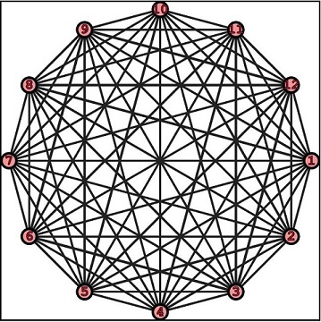
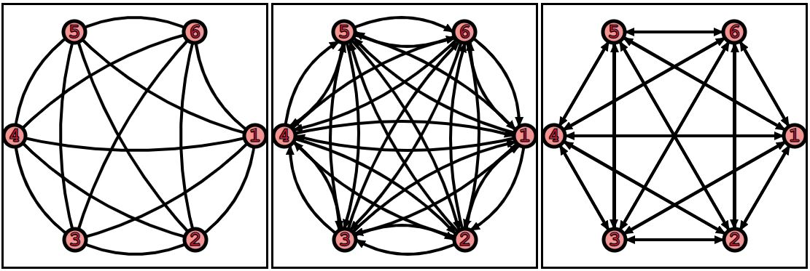

# **JsGraphs Tutorial**

There are two main entities that can be created in this library: graphs (class [_Graph_](../src/graph/graph.js)) and embeddings ([_Embedding_](../src/graph/embedding/embedding.js)).

The former focuses on modeling data and transforming it through algorithms, the latter is used to represent graphs on display (or paper!).

# **Graph**

A graph is a data structure that allow modeling interconnected data, where heterogeneous entities (the graph's vertices) can be in relation among them; these relations are modeled by graph's edges.

In _JsGraphs_, creating a graph is quite simple:

```javascript
import Graph from '/src/graph/graph.mjs';

let graph = new Graph();
```

The instance variable graph now has been created, without any vertex or edge. Of course, these entities are also modeled in the library:

## **Vertices**

Class [`Vertex`](../src/graph/vertex.js) implement the first basic component of any graph, in turn modeling the entities (data) part of a graph.

### **Create a Vertex**

```javascript
import Vertex from '/src/graph/vertex.mjs';

const v = new Vertex('vertex label', {weight: 3});
const u = new Vertex('u');
```

Vertices in _JsGraphs_ are immutable, hence `u` and `v` above are real consts. On creation, you must add a label for the vertex, and optionally a weight: the default weight for a vertex is 1, and generally you don't have to worry about this weight, but some graph applications can use it.

A vertex's label doesn't have to be a string, it can be any object that can be serialized to the `JSON` format: strings, numbers, arrays, plain JS objects, or custom objects that have a `toJson` method.

It is possible to use the `static` method `Vertex.isValidLabel` to check if a value is a valid label:

```javascript
Vertex.isValidLabel(1);   // true
Vertex.isValidLabel('abc');   // true
Vertex.isValidLabel([1, 2, true, 'a']);   // true
Vertex.isValidLabel({a: [1, 2, 3], b: {x: -1, y: 0.5}});   // true
Vertex.isValidLabel(new Vertex('test'));   // true, Vertex has a toJson() method
Vertex.isValidLabel(new Graph());   // true!! Graph has a toJson() method

Vertex.isValidLabel(new Map());   // false
Vertex.isValidLabel(new Set());   // false
Vertex.isValidLabel(() => true));   // false, functions can't be serialized to JSON
```

Existing vertices can be added to graphs: notice that it's NOT possible to add two vertices with the same label to the same graph.

```javascript
let graph = new Graph();
const v = new Vertex('v', {weight: 3});
const u = new Vertex('u');

graph.addVertex(v);
graph.addVertex(u);
// graph.addVertex(new Vertex('u)) // ERROR, duplicated vertex 'u'
```


There is also a shortcut to create those vertices directly on the graph, without first creating them as a separate variable; besides being shorter, this way is also more efficient, because vertices (and edges) _added_ to a graph are actually cloned beforehand (meaning that, in the example above, a clone of `v` and `u` is actually added to `graph`).

```javascript
let graph = new Graph();

const vId = graph.createVertex(['I', 'am', 'a', 'valid', 'label'], {weight: 3});
const uId = graph.createVertex('u');
// graph.createVertex('u) // ERROR, duplicated vertex 'u'
```
### **Vertex ID**

As you can see in the snippet above, `createVertex` (as well as `addVertex`) returns the ID of the vertex created (NOT a reference to the actual instance held by the graph).

Each vertex, in fact, has an `id` property that uniquely identifies it in a graph: as mentioned, there can't be two vertices with the same label, so there is a 1:1 correspondence between labels and IDs. This means that the IDs of two instances of `Vertex` can clash even if they are different objects, or if they have different properties.

```javascript
const u1 = new Vertex('u', {weight: 3});
const u2 = new Vertex('u');

console.log(u1.equals(u2));     // false
console.log(u1.id === u2.id);   // true
```

### **Retrieve a Vertex**

You might want to hold to the id of a vertex, because you will need it to retrieve a reference to the actual vertex from the graph, and even to create a new edge (as we'll see in the next section).

```javascript
const u = graph.getVertex(uId);
const v = graph.getVertex(vId);
```

Most of the methods on graphs can take either an id, or a copy of the object to retrieve (namely a vertex or an edge).
For instance:

```javascript
graph.getVertex(uId);
graph.getVertex(graph.getVertex(uId));
```

both work and return a reference to vertex `u` (although the latter does that very inefficiently!).

Once you get ahold of a reference to a graph's vertex, you can read all its fields, but you can only update its weight.


>  Although having vertices as perfectly immutable entities would have been desirable, this would have had repercussions on the performance of the graph, because updating a vertex `v`'s weight would have meant replacing `v` in the graph with a new instance of `Vertex`, and also updating all the references to `v` in (potentially, up to ) all the edges in the graph.
As a compromise, a vertex' label and id are kept immutable and impossible to change, while weight is mutable. Similar compromises will be made for embedded vertices and edges.
Switching to `TypeScript`, or whenever a future `EcmaScript` specification will include protected fields, would allow for more flexibility and possibly this aspect will be reviewed. For now, changing the mutable attributes of a graph's vertices and edges directly is **discouraged**: the **forward-compatible** way is going to be changing them through the `Graph` and `Embedding`'s methods.


## **Edges**

The other fundamental entity on which graphs are based are _edges_, implemented in class [`Edge`](../src/graph/edge.js).

Creating a new edge is as simple as creating a new vertex, except that we need to pass two instances of `Vertex` to the edge's constructor, for its source and destination:

```javascript
import Vertex from '/src/graph/vertex.mjs';
import Edge from '/src/graph/edge.mjs';

const v = new Vertex('vertex label', {weight: 3});
const u = new Vertex('u');

const e = new Edge(u, v, {weight: 0.4, label: "I'm an edge!"});
```

Like vertices, Edges are only mutable for what concers their weight: it's the only field of an edge that can be changed after it's created.

And likewise, edges also have an `id` field, that uniquely identify them in a graph: in simple graphs (like the ones implemented in classes `Graph` and `UndirectedGraph`), there can be at most a single edge between two vertices, so an edge's ID is based on the IDs of its source and destination, and can uniquely identify an edge _within a graph_.

Notice that two edges detached from any graph, or belonging to two different graphs, could be different while having the same ID (because, for instance, they have a different label or weight), but this is not possible within any individual graph.

### **Create an Edge**

You can add an existing edge to a graph with method `addEdge`, or equivalently (and perhaps more easily), you can create the new edge directly through an instance of `graph`:

```javascript
import Vertex from '/src/graph/vertex.mjs';
import Edge from '/src/graph/edge.mjs';
import Graph from '/src/graph/graph.mjs';

let g = new Graph();
const v = g.createVertex('v', {weight: 1.5});
const u = g.createVertex('u', {weight: 1.5});

const e = g.createEdge(u, v, {weight: 0.4, label: "I'm an edge!"});
```


### **Directed vs Undirected**

While the vertices at the two ends of an edge uniquely determine the edge's ID, it has to be clear that their order matters, at least in directed graphs.

In directed graphs, in fact, each edge has a direction associated, from its source to its destination, and so an edge from vertex `'u'` to vertex `'v'` is different than one from `'v'` to `'u'`.

```javascript
let g = new Graph();
const v = g.createVertex('v', {weight: 1.5});
const u = g.createVertex('u', {weight: 1.5});

const e1 = g.createEdge(u, v, {weight: 0.4, label: "back"});
const e2 = g.createEdge(v, u, {weight: 1.4, label: "and forth"});
```


### **Weight Matters**

While for vertices we saw that weight is something useful in niche situations, it's much more common to set a weight for edges: many graph's algorithms like _Dijkstra's_ or _A*_ make sense only on weighted graphs (while for unweighted graphs, i.e. graphs whose edges have no weights associated, we can likely make do with _BFS_).

In many applications we'll need to update the weight of graph edges after its creation: like for vertices, it is possible to retrieve an edge and update its weight, but the safest way to do so is by using the `setEdgeWeight` method on an instance of `Graph`.

```javascript
let g = new Graph();
const v = g.createVertex('v', {weight: 1.5});
const u = g.createVertex('u', {weight: 1.5});

const e = g.createEdge(u, v, {weight: 0.4, label: "back"});
g.setEdgeWeight(e, 1.5);
g.setEdgeWeight(e.id, -3.1);
```

### **Retrieving an Edge**

The easiest way to get ahold of a reference to a graph's edge is through its ID:

```javascript
let e = g.getEdge(e.id);
e = g.getEdge(edgeID);  // Assuming you have the ID stored in this variable
```

If you don't have the edge's ID at hand, though, do not despair! You can also retrieve an edge by passing its source and destination to method `getEdgeBetween` (since, as mentioned, there can only be one vertex in a simple graph from a source to a destination).

```javascript
let e = g.getEdgeBetween(u, v);
// You can also pass vertices' IDs
e = g.getEdgeBetween(u.id, v.id);
// ... and even mix them
e = g.getEdgeBetween(u, v.id);
e = g.getEdgeBetween(u.id, v);
```

### **Loops**

Last but not least, so far we have always assumed that source and destination of an edge are distinct: this doesn't necessarily need to be true. In other words, it's possible to have an edge starting from and ending to the same vertex: in this case, the edge is called a loop.

```javascript
let loop = g.getEdgeBetween(u, u, {label: 'Loop'});
```


## **Graph class**

The only thing that still needs to be said about class `Graph` as a data structure is that it implements an undirected graph.

Class `Graph` implements directed graphs, where the direction of an edge matter.

If, instead, we don't care about that, and edges can be traveled in both directions, then the right class to use is `UndirectedGraph`.

Let's explore the difference with a couple of examples.

### **Generators**

Both classes offers generators to simplify the creation of some of the most common classes of graphs; in the following sections, we'll explore the available ones, and lay out the roadmap to implement more of these.

### **Complete Graphs**

In a complete graph, each vertex is connected by an edge to each other vertex in the graph; in these graphs, the number of edges is maximal for simple graphs, quadratic with respect to the number of vertices.

> Notice that a complete graph doesn't contain loops.

Creating complete graphs is easy, you just need to pass the number of vertices that the graph will hold:

```javascript
import { UndirectedGraph } from '/src/graph/graph.mjs';

let g = Graph.completeGraph(12);
let ug = UndirectedGraph.completeGraph(12);
```

Of course, the labels for the vertices are standard, just the numbers between 1 and n.
The representation of such graphs is cool for both directed and undirected ones:



> We'll discuss how to get these drawings later, in the section about embeddings.

### **Bipartite Complete Graphs**

In a bipartite graph vertices can be partitioned in two groups, such that vertices in each group are only connected with vertices in the other group (in other words, each vertex in group A can't have any edge to another vertex within group A, and likewise for the other group).

A complete bipartite graph just has all the possible edges between the two groups: check the figures to get an idea.

```javascript
let g = Graph.completeBipartiteGraph(4, 6);   // Just pass the sizes of the two groups
let ug = UndirectedGraph.completeBipartiteGraph(7, 3);
```


### **Generators: TODO**

- [x] Complete Graphs
- [x] Bipartite Complete Graphs
- [ ] Square Mesh
- [ ] Triangular Mesh
- [ ] Random Graph

### **Serialization**

Well, turns out there is another important thing to mention: _serialization_. All the entities in _JsGraphs_ are serializable to _JSON_, and can be created back from a _JSON_ file.

```javascript
let g = new Graph();
// ...
const json = g.toJson();
let g1 = Graph.fromJSON(json);
```
This is an important property (and the reason why we restricted the type of valid labels), because it allows you to create a graph in any other platform/language, possibly run algorithms or transformations on it, and then export it to a _JSON_ file, pick it up in you web app with _JsGraphs_, and display it.

Or, vice versa, create it in JS (perhaps with an ad-hoc tool: stay tuned!), and then import it in your application written in any other language, or just store it in a **database** and retrieve it later.

As long as you adhere by the (simple) format used, compatibility is assured.

# **Embedding**

While many graphs' applications are interested in the result of applying one of the algorithms above, there are many, probably just as many, for which either the visual feedback or the actual way we lay out vertices and edges on a plane (or in a 3D space) are fundamental.

An embedding, and in particular a planar embedding, is technically an isomorphism...
but to keep things simple here, we can describe it as a way to assign a position to each vertex and draw each edge with a curve or polyline.

In this library, we will restrict the way in which we draw edges; they will be either:
- Straight line segments;
- Quadratic Bézier curves, with their control point lying on a line perpendicular to the edge and passing through its middle point.

This, obviously, restricts the set of possible ways to draw a graph (for instance, polylines or higher order curves are not allowed), but it allows a simpler approach, while still leaving plenty of options for nice and effective drawings.

We'll see how this simplification is important when we get to automatic embedding generators.

## **Of Appearance and Essence**

This dualism is common in computer science, so much so that there is one of the fundamental design patterns, _MVC_, that guides how the former should be separated from the latter.

Applied to graphs, the substance is the graph data structure, which has the maximum level of abstraction: it's a perfect candidate for the _Model_ part of MVC pattern.

In a way, an embedding is partly more about the form than the graph itself: we arrange vertices and esges as a way to _display_ a graph, to make it easier to comprehend to humans.

An embedding, however, can also be substance: for instance if vertices are electronic components on a circuit board, and edges are connective tracks, then their position is not just about appearance.

For our `Embedding` class, we have thus tried to separate form and substance accordingly: all the attributes that we can associate with an embedding's structure (its substance) can be passed to the construtor and modified using setters.

The form, for class `Embedding`, is the way we can later represent it: this is a separate concern, in line with MVC; regardless of whether we provide methods inside this class to generate the view, it's possible to write separate classes taking an embedding an generating a view.

The build-in methods to generate a view for an `Embedding` are `toJson`, to produce a _JSON_ representation of the embedding (and serialize/deserialize it), and - perhaps more interestingly - `toSvg` that generates _SVG_ markup for vertices and edges.

Again, this method is provided so that you have an out-of-the-box default way to display a graph, but it's decoupled from the model, relying on its public interface only, so that you can also write your own class to handle the view part.

This decoupling also translates to the fact that you will need to pass everything that is related to the _View_ (i.e. the form) to method `toSvg` directly (and each time you call it). More on this in a few lines...

## ***Create an Embedding...***

Embeddings creation works following the same logic as graphs: an embedding, in particular, is a collection of embedded vertices (class `EmbeddedVertex`), meaning graph's vertices to which we assigned a position with respect to some coordinate system, and embedded edges (class `EmbeddedEdge`), whose position is determined by the vertices at their ends, but for which we can still decide how they are drawn.

You should never worry about these two classes: although they are public classes and you can retrieve a reference to either through an instance of `Embedding`, you should never need to interact with those classes directly.

While it is true that the constructor for `Embedding` takes two collections as input, one of embedded vertices and one of embedded edges, there are easier way to create an embedding from a graph.

### **... From a Graph**

The easiest way is to create an embedding starting from an existing graph:

```javascript
import Embedding from '/src/graph/embedding/embedding.mjs';

let g = new Graph();
const v = g.createVertex('v', {weight: 1.5});
const u = g.createVertex('u', {weight: 1.5});

const e = g.createEdge(u, v, {weight: 0.4, label: "back"});

let embedding = Embedding.forGraph(g, {width: 640, height: 480});
```

This will create an embedding for graph `g`, where the positions of the vertices are chosen randomly within a canvas of the specified size (in this case, a box spanning from `(0, 0)` to `(639, 479)`).

To control how the vertices and edges are laid out, we can pass two optional arguments to the static method `forGraph`:

- `vertexCoordinates`, a map between vertices' IDs and `Point2D` objects specifying where the vertex center will lie in the embedding;
- `edgeArcControlDistances`, another map, this time between edges' IDs and a parameter regulating how the edge is drawn (more on this later).

```javascript
let g = new Graph();
const v = g.createVertex('v', {weight: 1.5});
const u = g.createVertex('u', {weight: 1.5});

const e = g.createEdge(u, v, {weight: 0.4, label: "back"});

let embedding = Embedding.forGraph(g, {
  width: 640,
  height: 480,
  vertexCoordinates: {
    [v]: new Point2D(100, 100),
    [u]: new Point2D(400, 300)
  },
  edgeArcControlDistances: {
    [e]: -60
  }
});
```

Alternatively, it's possible to change a vertex' position or an edge's control distance at any time, using:

```javascript
// Depending on your coordinate system, real (or even negative) coordinates can make sense
embedding.setVertexPosition(v, new Point2D(-1, -1));
embedding.setEdgeControlPoint(e, 3.14);
```

### **... or, with Generators**

The other suggested way to create embeddings is through generators. We have already seen how to speed up the creation of graphs for some of the most common types, like complete graphs for instance.

It is totally possible to create a graph first and then the embedding manually, like this:

```javascript
let g = Graph.completeGraph(9);
let embedding = Embedding.forGraph(g, {width: 480, height: 480});
```

The result, however, is not as appalling as you might expect, because the positions of the vertices are assigned randomly.


It's still possible to manually set the position of each vertex... but it's quite tedious, right?
Instead, we can use the matching generators provided by class `Embedding`, that will also automatically assign positions to the vertices in order to obtain a nice drawing.

```javascript
let embedding = Embedding.completeGraph(9, 480, false);
```


## **About Edge Drawing**

As already mentioned, we only allow edges to be drawn as line segments or arcs, in the form of quadratic Bézier curves.
These curves are a subset of second order polynomials whose trajectory is determined by a _control point_, that is going to be the third vertex in a triangle including the two ends of the curve.

The curve will then be the interpolation of the two linear Bézier curves between the first end and the control point, and between the control point and the second end of the curve.

For _JsGraphs_ we further restrict to only the quadratic Bézier curves whose control point lies on a line perpendicular to the segment connecting the two edge's ends, and passing in the middle point of said segment: the following figure illustrates this case:


Notice that the distance between the control point and the two ends will always be the same, so the arc drawn for the edge will be symmetrical.

We can control the curvature of the arc by setting the distance of the control point from the segment on which the two ends lie, i.e. parameter `d` in the figure above: that's exactly the value set by method `setEdgeControlPoint`.

If we set this distance to `0`, we will draw the arc as a straight line segment; positive values will cause the edge's curve to point up, while negative values will make the curve point down.

```javascript
let g = new Graph();
const v = g.createVertex('v', {weight: 1.5});
const u = g.createVertex('u', {weight: 1.5});

const e = g.createEdge(u, v);

let embedding = Embedding.forGraph(g);

embedding.setVertexPosition(u, new Point2D(30, 60));
embedding.setVertexPosition(v, new Point2D(270, 60));

embedding.setEdgeControlPoint(e, 70);
// Draw 1
embedding.setEdgeControlPoint(e, 0);
// Draw 2
embedding.setEdgeControlPoint(e, -70);
// Draw 3
```


You can also find a deeper explanation of [Bézier curves](https://en.wikipedia.org/wiki/Bézier_curve#Quadratic_curves) on Wikipedia, and of how they work in SVG on [Mozilla's developer blog](https://developer.mozilla.org/en-US/docs/Web/SVG/Tutorial/Paths).

## **Styling**

Styling, i.e. the _appearance_ part, is mainly specified through CSS: each vertex and each edge can individually be assigned one or more CSS classes, at the moment the SVG is generated.

Additionally, there a few parameters that can be tuned to enable/disable features, like displaying edges' labels and weights, or disabling arcs in favor of line segments.

It's also possible to assign CSS classes to the group containing the whole graph.

```javascript
let embedding = Embedding.forGraph(g);
// [...]
embedding.toSvg(700, 550, {
  graphCss: ['FSA'],          // This class is added to the whole graph, can be used as a selector
  verticesCss: {[u]: ['source'], [v]: ['dest', 'error'],
  edgesCss: {[e]: ['test1', 'test2']},
  drawEdgesAsArcs: true,      // Display edges as curves or segments
  displayEdgesLabel: false,  //  No label added to edges
  displayEdgesWeight: false   // Weights are not displayed either
})
```

The output will look something like:

```html
<svg width="300" height="120">

  <defs>
    <marker id="arrowhead" markerWidth="14" markerHeight="12" markerUnits="userSpaceOnUse" refX="13" refY="6" orient="auto">
      <polygon points="0 0, 14 6, 0 12" style="fill:var(--color-arrow)"/>
    </marker>
    <linearGradient id="linear-shape-gradient" x2="0.35" y2="1">
      <stop offset="0%" stop-color="var(--color-stop)" />
      <stop offset="30%" stop-color="var(--color-stop)" />
      <stop offset="100%" stop-color="var(--color-bot)" />
    </linearGradient>
    <radialGradient id="radial-shape-gradient" cx="50%" cy="50%" r="50%" fx="50%" fy="50%">
      <stop offset="0%" stop-color="var(--color-inner)" style="stop-opacity:1" />
      <stop offset="50%" stop-color="var(--color-mid)" style="stop-opacity:1" />
      <stop offset="100%" stop-color="var(--color-outer)" style="stop-opacity:1" />
    </radialGradient>
  </defs>
  <g class="graph FSA">
    <g class="edges">
      <g class="edge test1 test2" transform="translate(30,60)">
        <path d="M0,0 Q120,70 218,0"
        marker-end="url(#arrowhead)"/>
      </g>
    </g>
    <g class="vertices">
      <g class="vertex dest error" transform="translate(270,60)">
        <circle cx="0" cy="0" r="22.5" />
        <text x="0" y="0" text-anchor="middle" dominant-baseline="central">v</text>
      </g>
      <g class="vertex source" transform="translate(30,60)">
        <circle cx="0" cy="0" r="22.5" />
        <text x="0" y="0" text-anchor="middle" dominant-baseline="central">u</text>
      </g>
    </g>
  </g>
</svg>
```

Finally, an example of how a combination of different visualization styles and different structural changes (directed vs undirected edges) can impact how a graph is perceived:




# **Graph Algorithms**

The most interesting part about graphs is that, once we have created one, we can run a ton of algorithms on it.

Here there is a list of algorithms that are implemented (or will be implemented) in _JsGraphs_:


## **BFS**

It's possible to run the **B**readth **F**irst **S**earch algorithm on both directed and undirected graphs.

```javascript
import { range } from '/src/common/numbers.mjs';

let g = new Graph();
range(1, 8).forEach(i => g.createVertex(`${i}`, {weight: 1.5})); // Create vertices "1" to "7"

g.createEdge(v1, v2);
g.createEdge(v1, v3);
g.createEdge(v2, v4);
g.createEdge(v3, v5);
g.createEdge(v3, v4);
g.createEdge(v4, v6);
g.createEdge(v6, v7);

const bfs = g.bfs('"1"');
```

If we print out the result of running bfs, we obtain an object with both the distance and predecessor of each vertex in the graph (at least, each one reachable from the start vertex, `"1"` in this case).

```javascript
{
  distance: {"1": 0, "2": 1, "3": 1, "4": 2, "5": 2, "6": 3, "7": 4},
  predecessor: {"1": null, "2": '"1"', "3": '"1"', "5": '"3"', "4": '"3"', "6": '"4"', "7": '"6"'}
}
```

That's not the easiest to visualize, though. One thing we can do, is reconstruct the path from the start vertex to any of the reacheable vertices (in this case, any other vertex in the graph, because they are all reacheable from `"1"`).

The result of the `Graph.bfs` method, in fact, is an object, an instance of class `BfsResult`, that in turn offer an interesting method: `reconstructPathTo`. This method takes a destination vertex, and returns the shortest path (if any) from the starting point.

```javascript
bfs.reconstructPathTo('"7"');   // [""1"", ""3"", ""4"", ""6"", ""7""]
```

That's better, right? But how cooler would it be if we could also visualize it?
Well, luckily we can! Remember, from the [_Embedding_](#embedding) section, that we can assign custom _CSS_ classes to edges and vertices? Well, this is a good time to use that feature!

Let's start by creating an embedding for the graph:

```javascript
let embedding = Embedding.forGraph(g, {width: 480, height: 320});

embedding.setVertexPosition('"1"', new Point2D(30, 180));
embedding.setVertexPosition('"2"', new Point2D(120, 40));
embedding.setVertexPosition('"3"', new Point2D(150, 280));
embedding.setVertexPosition('"4"', new Point2D(200, 150));
embedding.setVertexPosition('"5"', new Point2D(300, 280));
embedding.setVertexPosition('"6"', new Point2D(350, 220));
embedding.setVertexPosition('"7"', new Point2D(450, 150));

embedding.setEdgeControlPoint('["2"]["4"]', 20);
embedding.toSvg(480, 320, {drawEdgesAsArcs: true, displayEdgesWeight: false});
```

At this point, the result of drawing the embedding is more or less the following:


Now, we want to highlight that path, starting at vertex `"1"` and ending at vertex `"7"`. The issue with the result of `reconstructPathTo` is that it returns the sequence of vertices in the path, and while that does help us highlighting vertices, we would also like to assign a different css class to the edges in the path.

To do so, we also need to use method `Graph.getEdgesInPath`, that given a sequence of vertices, returns the edges connecting each adjacent pair.

Then, it's just up to us to choose the classes to assign to edges and vertices in the path.

```javascript
const path = bfs.reconstructPathTo('"7"');
const edges = g.getEdgesInPath(path);
let vCss = {};
path.forEach(v => vCss[v] = ['inpath']);
vCss['"1"'].push('start');
vCss['"7"'].push('end');

let eCss = {};
edges.forEach(e => eCss[e.id] = ['inpath']);

embedding.toSvg(480, 320, {
  drawEdgesAsArcs: true,
  displayEdgesWeight: false,
  verticesCss: vCss,
  edgesCss: eCss,
  graphCss: ['bfs']
});
```

This is the final result:


Of course, to get the style right, we need to add a few CSS rules, for instance:

```css
.graph.bfs g.vertex.inpath circle {
  stroke: crimson;
}
.graph.bfs g.vertex.start circle, .graph.bfs g.vertex.end circle {
  fill: darkorange;
  stroke-width: 7;
}
.graph.bfs g.vertex.start circle, .graph.bfs g.vertex.end text {
  fill: white;
}
.graph,bfs g.edge path {
  fill: none;
  stroke: black;
  stroke-width: 3;
}
.graph.bfs g.edge.inpath path {
  fill: none;
  stroke: crimson;
  stroke-width: 5;
}
```

## **In Progress**

Check out our [RoadMap](../README#algorithms).